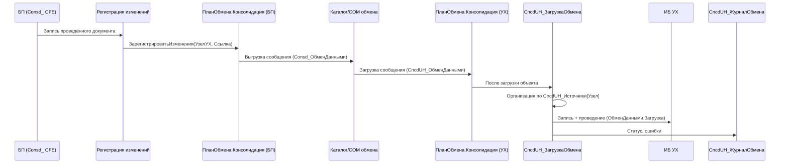
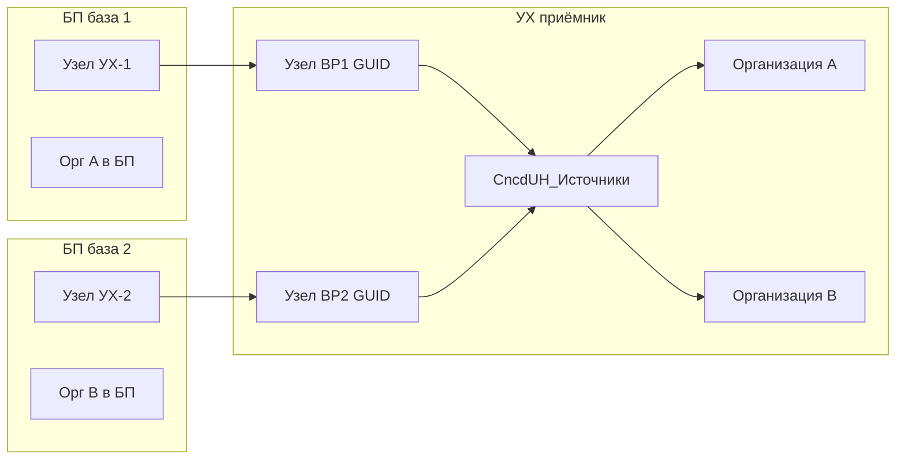
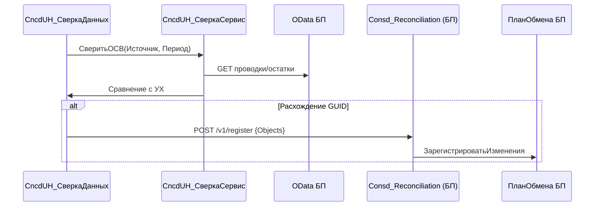

# Архитектурный проект: обмен «Консолидация» — приёмник УХ

Расширение: `ICORUHM/uh-cfe-consolidation/` (`КонсолидацияУХ`, префикс `CncdUH_`).  
Контрагент: `acclmcopy-cfe-consolidation/` (`Консолидация`, префикс `Consd_`).

Источник проекта: агент `1c-code-architect`, дата 2026-07-14.

---

## 1. Найденные паттерны и соглашения

### 1.1. Сторона источника (БП) — эталон

| Паттерн | Где | Суть |
|---------|-----|------|
| План обмена «Консолидация» | `ExchangePlans/Консолидация.xml` | `DistributedInfoBase=false`, не РИБ, не XDTO |
| Состав 196 объектов | `ExchangePlans/Консолидация/Ext/Content.xml` | 117 док. + 77 спр. + план счетов + виды субконто; `AutoRecord=Allow` |
| Программная регистрация | `Consd_РегистрацияИзменений` + подписка на `DocumentObject.OnWrite` | Только проведённые документы с движениями по `Хозрасчетный` |
| Менеджер плана | `ExchangePlans/Консолидация/Ext/ManagerModule.bsl` | `ЗарегистрироватьИзмененияОбъекта`, `ЗарегистрироватьИзмененияДляВсехУзлов` |
| Регистр источников | `InformationRegister.Consd_Источники` | Измерение `Организация` → ресурсы `Адрес` (OData), `Узел` |
| Сверка | `Consd_СверкаДанных` + `Consd_СверкаСервис` | OData к БП + HTTP `/hs/recon/v1/*` для ping/nodes/register |
| Правила обмена | Шаблоны `ПравилаРегистрации`, `ПравилаОбменаКорреспондента` | Классический формат правил конвертации (PVD), не EnterpriseData |
| Подсистема | `Consd_Консолидация` | Обмен, настройка, сверка, журнал, узлы |

CFE: `Purpose=AddOn`, `NamePrefix=Consd_`, авторегистрация **Allow** (не Enable).

### 1.2. Конфигурация УХ (ориентир заимствований)

- Конфигурация: **УправлениеХолдингом 3.2** (`ICORUHM/Configuration.xml`).
- Тот же регистр бухгалтерии `AccountingRegister.Хозрасчетный`, план счетов `ChartOfAccounts.Хозрасчетный`, субконто `ChartOfCharacteristicTypes.ВидыСубконтоХозрасчетные`.
- Типовой план `ExchangePlan.ОбменДаннымиБПУХ` — **XDTO / EnterpriseData**, БСП «Синхронизация данных». **Не используем** для «Консолидации»: контракт БП-CFE построен на классическом обмене с PVD-правилами (`BPLM-UHLM_light.xml`, manifest 112 док. + 34 спр.).
- Расширение EMS (`EMS/`) — паттерн сопоставления организаций (`EMS_КодСопоставленияОрганизации`), HTTP-свер сверки; учитываем, но не смешиваем с CFE.

### 1.3. Риск несовпадения метаданных

Проверка показала: часть документов из `object-list.json` БП **отсутствует в УХ** (например, `ОбесценениеВнеоборотныхАктивов`, `ОперацияСИнвестиционнымВычетом`). Состав приёмника = **пересечение** manifest и метаданных УХ; расхождения фиксируются в артефакте задачи (`uh-missing-objects.json`).

---

## 2. Архитектурное решение

### Выбранный подход (единственный)

**Симметричный классический обмен по плану обмена «Консолидация»** с правилами конвертации PVD, односторонней загрузкой БП→УХ и обратной сверкой через OData/HTTP.

| Аспект | Решение | Обоснование |
|--------|---------|-------------|
| Транспорт | Файловый обмен / прямое подключение через стандартную «Конвертацию объектов» | Совместимость с BP-CFE, без XDTO |
| Формат | XML сообщений плана обмена + PVD-правила | Уже заложено в шаблонах BP-CFE |
| План обмена | **То же имя** `Консолидация` на обеих узлах | Требование платформы для корреспондентов |
| Симметрия состава | Те же заимствованные объекты, `AutoRecord=Deny` на УХ | Приёмник не регистрирует исходящие изменения |
| Идентификация источников | **1 узел плана = 1 база БП**; код узла = GUID «Этот узел» БП | Несколько идентичных баз БП |
| Mapping | PVD-правила из `BPLM-UHLM_light.xml` + постобработка `CncdUH_ЗагрузкаОбмена` | Организация, счета, УХ-специфика |
| Сверка | `CncdUH_СверкаДанных` → OData БП + HTTP `Consd_Reconciliation` | Зеркало BP-обработки, инициатор — УХ |
| HTTP на УХ | `CncdUH_Reconciliation` — только ping/статус | Регистрация изменений остаётся на БП |
| UI | Отдельная подсистема `CncdUH_Консолидация` | Не завязываем на БСП XDTO в первой версии |

**Не выбираем:** `ОбменДаннымиБПУХ` (XDTO), РИБ, универсальный формат EnterpriseData — ломает контракт с BP-CFE.

### Роль приёмника

1. **Принимает** справочники и проведённые документы с движениями по `Хозрасчетный`.
2. **Идентифицирует источник** по узлу отправителя + регистру `CncdUH_Источники`.
3. **Пишет** объекты с `ОбменДанными.Загрузка=Истина`, проводит документы, логирует в `CncdUH_ЖурналОбмена`.
4. **Не регистрирует** исходящие изменения (все `AutoRecord=Deny`).
5. **Сверяет** остатки/обороты и GUID с каждой БП; при расхождениях инициирует регистрацию на БП через HTTP.

---

## 3. Проект компонентов

```
ICORUHM/uh-cfe-consolidation/
├── Configuration.xml                          # AddOn, NamePrefix=CncdUH_, Name=КонсолидацияУХ
├── Subsystems/CncdUH_Консолидация.xml
├── ExchangePlans/
│   └── Консолидация/                          # Симметричный план (собственный объект CFE)
│       ├── Консолидация.xml
│       ├── Ext/
│       │   ├── Content.xml                    # ~196 объектов, AutoRecord=Deny
│       │   ├── ManagerModule.bsl              # Загрузка, журнал, привязка узла
│       │   └── ObjectModule.bsl               # ПередЗаписью узла
│       ├── Forms/ФормаУзла/
│       └── Templates/
│           ├── ПравилаОбмена/                  # БП → УХ (основные)
│           ├── ПравилаОбменаКорреспондента/    # УХ → БП (минимум: квитанции)
│           └── ПравилаРегистрации/             # Пустые/заглушка (на УХ не используются)
├── CommonModules/
│   ├── CncdUH_ЗагрузкаОбмена/                 # Постобработка после загрузки
│   ├── CncdUH_СверкаСервис/                   # OData + HTTP к БП
│   ├── CncdUH_СопоставлениеОбъектов/          # GUID, организации, счета
│   └── CncdUH_ОбменСлужебный/                 # Общие утилиты, JSON, URL
├── DataProcessors/
│   ├── CncdUH_НастройкаОбмена/                # Мастер: узел, правила, первичная синхронизация
│   ├── CncdUH_ОбменДанными/                   # Выгрузка/загрузка сообщений
│   └── CncdUH_СверкаДанных/                   # ОСВ, объекты, регистрация на БП
├── InformationRegisters/
│   ├── CncdUH_Источники/                      # База БП ↔ организация УХ ↔ узел
│   ├── CncdUH_ЖурналОбмена/                   # Сессии загрузки, ошибки
│   └── CncdUH_СопоставлениеОбъектов/          # GUID источник → ссылка УХ (опционально, кэш)
├── HTTPServices/CncdUH_Reconciliation/        # ping, health (без register)
├── ScheduledJobs/CncdUH_АвтоЗагрузкаОбмена/   # Опционально
├── Roles/
│   ├── CncdUH_ОсновнаяРоль/                   # scaffold, минимум
│   ├── CncdUH_АдминистраторОбмена/
│   └── CncdUH_ОператорОбмена/
├── CommandGroups/CncdUH_СинхронизацияДанных/
└── [заимствованные Catalog/Document/...]     # из ICORUHM (cfe-borrow)
```

### Ответственности модулей

| Компонент | Обязанности | Зависимости |
|-----------|-------------|-------------|
| `ExchangePlan.Консолидация` (Manager) | `ЗагрузитьСообщение()`, запись журнала, определение источника по узлу | `CncdUH_ЗагрузкаОбмена`, `CncdUH_Источники` |
| `CncdUH_ЗагрузкаОбмена` | Постобработка: организация, проведение, блокировки, транзакции | PVD + `CncdUH_СопоставлениеОбъектов` |
| `CncdUH_СопоставлениеОбъектов` | GUID→ссылка, код организации БП→`Catalog.Организации` УХ | `CncdUH_Источники`, при необходимости EMS-паттерн |
| `CncdUH_СверкаСервис` | OData-запросы к БП, вызов `Consd_Reconciliation` | HTTP, `Consd_СверкаСервис` API |
| `CncdUH_ОбменДанными` | UI: выбор узла, каталог обмена, запуск загрузки | Стандартная конвертация / `ОбменДаннымиСервер` |
| `CncdUH_НастройкаОбмена` | Создание узла, обмен кодами, загрузка правил, заполнение источников | Формы узла |
| `CncdUH_СверкаДанных` | ОСВ по организациям/источникам, отчёт расхождений | Зеркало `Consd_СверкаДанных` |
| `CncdUH_Источники` | КодИсточника (GUID узла БП), Организация, Узел, АдресOData, учётные данные | — |
| `CncdUH_ЖурналОбмена` | Дата, Узел, Направление, Статус, Количество, ТекстОшибки | — |

### Регистр `CncdUH_Источники` (расширенная модель)

| Объект | Тип | Назначение |
|--------|-----|------------|
| **КодИсточника** (измерение) | Строка(36) | GUID узла «Этот узел» базы БП |
| **Организация** (измерение) | `CatalogRef.Организации` | Организация в УХ |
| Наименование | Строка | Человекочитаемое имя базы |
| Узел | `ExchangePlanRef.Консолидация` | Узел-корреспондент в УХ |
| АдресOData | Строка(500) | URL OData БП |
| ИмяПользователяOData | Строка | Для сверки |
| ПарольOData | Строка | Хранить с ограничением прав |
| Активен | Булево | Участие в автообмене/сверке |

Зеркало `Consd_Источники` на БП: там измерение — организация **источника**, ресурс `Узел` — узел УХ в БП.

---

## 4. Карта реализации

### Фаза 0 — артефакты задачи

Каталог: `.tasks/task-cfe-consolidation-uh/`

- `uh-object-list.json` — пересечение BP `object-list.json` ∩ метаданные `ICORUHM`
- `uh-missing-objects.json` — объекты только в БП
- `uh-borrow-manifest.json` — для `cfe-borrow` / `run-borrow.ps1`
- `phase0-complexity.md`, `phase1-requirements.md` — есть
- `architecture.md` — этот файл

### Фаза 1 — каркас CFE

| Действие | Skill | Файлы |
|----------|-------|-------|
| Дополнить scaffold | `cfe-init` | `Configuration.xml`, `Languages/Русский.xml` |
| Роли | `role-compile` | `CncdUH_ОсновнаяРоль`, `CncdUH_АдминистраторОбмена`, `CncdUH_ОператорОбмена` |
| Подсистема | `subsystem-compile` | `CncdUH_Консолидация` |

Свойства расширения:

```xml
<Name>КонсолидацияУХ</Name>
<NamePrefix>CncdUH_</NamePrefix>
<ConfigurationExtensionPurpose>AddOn</ConfigurationExtensionPurpose>
<ConfigurationExtensionCompatibilityMode>Version8_3_21</ConfigurationExtensionCompatibilityMode>
```

### Фаза 2 — план обмена

| Объект | Изменения |
|--------|-----------|
| `ExchangePlan.Консолидация` | `DistributedInfoBase=false`, `CodeLength=36`, реквизиты как на БП (`ДатаНачалаВыгрузкиДокументов`, `РегистрироватьИзменения=false`, отбор по организациям) |
| `Content.xml` | Те же Metadata (из пересечения), везде `<AutoRecord>Deny</AutoRecord>` |
| `ФормаУзла` | По образцу BP + поля источника (OData, организация) |
| Шаблоны правил | `ПравилаОбмена` из `BPLM-UHLM_light.xml`; корреспондент — заглушка |

### Фаза 3 — заимствование объектов

PowerShell-скрипт по образцу `.tasks/task-cfe-consolidation/run-borrow.ps1`:

- Источник метаданных: `ICORUHM/`
- Цель: `uh-cfe-consolidation/Catalogs|Documents|...`
- Только объекты из `uh-borrow-manifest.json`
- `cfe-validate` после заимствования

### Фаза 4 — регистры и общие модули

| Объект | meta-compile / meta-edit |
|--------|---------------------------|
| `CncdUH_Источники` | Независимый, формы списка/записи |
| `CncdUH_ЖурналОбмена` | Периодический или по дате сеанса |
| `CncdUH_СопоставлениеОбъектов` | Необязательно в v1; ускоряет повторные загрузки |
| `CncdUH_ЗагрузкаОбмена` | Server, привилегированный |
| `CncdUH_СверкаСервис` | Server, HTTP + OData |
| `CncdUH_СопоставлениеОбъектов` | Server |
| `CncdUH_ОбменСлужебный` | Server, повторное использование JSON/URL из BP |

**Ключевые экспортные процедуры `CncdUH_ЗагрузкаОбмена`:**

- `ПослеЗагрузкиОбъекта(Узел, Объект, Отказ)`
- `ПередЗаписьюПриЗагрузке(Источник, Отказ)`
- `ОпределитьОрганизациюПоУзлу(Узел)`
- `ЗаписатьСтрокуЖурнала(ПараметрыСеанса)`

### Фаза 5 — обработки и HTTP

| Обработка | Функции |
|-----------|---------|
| `CncdUH_НастройкаОбмена` | Мастер: узел ↔ БП, загрузка правил, тест связи |
| `CncdUH_ОбменДанными` | Ручная/авто загрузка из каталога или COM |
| `CncdUH_СверкаДанных` | Порт логики `Consd_СверкаДанных` на контекст УХ |
| `CncdUH_Reconciliation` | GET `/hs/recon/v1/ping` |

### Фаза 6 — права и интерфейс

- `CncdUH_АдминистраторОбмена` — полный доступ (по образцу `Consd_АдминистраторОбмена`)
- `CncdUH_ОператорОбмена` — обмен + сверка + журнал (чтение источников)
- Командная группа `CncdUH_СинхронизацияДанных` в подсистеме

### Фаза 7 — загрузка в ИБ и приёмка

- `db-load-xml` → база `ICORU_DEV` (id `uh-lm`)
- Настройка узлов: для каждой БП — узел с кодом GUID
- Тестовая выгрузка с `bp-copy` → загрузка в `ICORU_DEV`
- Сверка OData + HTTP register

---

## 5. Потоки данных

### 5.1. Основной обмен БП → УХ



### 5.2. Идентификация нескольких баз БП



### 5.3. Обратная сверка



---

## 6. Последовательность сборки (чек-лист)

### Phase 0 — Discovery
- [ ] Сгенерировать `uh-object-list.json` (пересечение с `ICORUHM`)
- [ ] Зафиксировать `uh-missing-objects.json`
- [ ] Согласовать: исключить отсутствующие в УХ или добавить заглушки в правила

### Phase 1 — Scaffold CFE
- [ ] `Configuration.xml`, язык, 3 роли
- [ ] `cfe-validate`

### Phase 2 — План обмена
- [ ] `ExchangePlan.Консолидация` + `Content.xml` (Deny)
- [ ] Форма узла
- [ ] Шаблоны правил (PVD)
- [ ] `ManagerModule.bsl` (каркас)

### Phase 3 — Borrow
- [ ] `run-borrow-uh.ps1` по manifest
- [ ] заимствованные XML из пересечения
- [ ] `cfe-validate`

### Phase 4 — Метаданные CncdUH_*
- [ ] Регистры: Источники, ЖурналОбмена
- [ ] Общие модули (4 шт.)
- [ ] Подсистема + командная группа

### Phase 5 — Обработки
- [ ] `CncdUH_НастройкаОбмена`
- [ ] `CncdUH_ОбменДанными`
- [ ] `CncdUH_СверкаДанных` (адаптация логики BP)
- [ ] `CncdUH_Reconciliation` (ping)

### Phase 6 — Правила и mapping
- [ ] Адаптация PVD под УХ (организация, счета)
- [ ] `CncdUH_ЗагрузкаОбмена` — постобработка
- [ ] Тест на 3–5 типовых документов

### Phase 7 — Права и UI
- [ ] Роли и `Rights.xml`
- [ ] Командный интерфейс подсистемы

### Phase 8 — DB и приёмка
- [ ] `db-load-xml` в `ICORU_DEV` (id `uh-lm`)
- [ ] Настройка 2+ узлов (мульти-источник)
- [ ] E2E: выгрузка BP → загрузка UH → сверка ОСВ
- [ ] `phase-d-acceptance.md`

---

## 7. Критические детали

### 7.1. Транзакции и загрузка

- Загрузка одного сообщения — **одна транзакция** на пакет платформы; при ошибке проведения — откат пакета, запись в журнал.
- В обработчиках загрузки: `ОбменДанными.Загрузка = Истина`; не вызывать лишнюю регистрацию на плане УХ.
- Проведение документов — внутри той же транзакции, где возможно; длительные пакеты (>20 с) — **разбивать** (std783).
- В `Исключение` после `НачатьТранзакцию` — сначала `ОтменитьТранзакцию`, без обращений к БД в блоке except.

### 7.2. Производительность

- Порционная загрузка штатным механизмом обмена.
- Сверка ОСВ — порциями по организациям/месяцам; OData без `SELECT *`.
- Регистр `CncdUH_СопоставлениеОбъектов` — индекс по `(КодИсточника, Тип, GUID)`.
- Регламентное задание `CncdUH_АвтоЗагрузкаОбмена` — с блокировкой повторного запуска.

### 7.3. Права

| Роль | Права |
|------|-------|
| `CncdUH_АдминистраторОбмена` | Полный доступ к CncdUH_*, узлам, правилам, источникам |
| `CncdUH_ОператорОбмена` | Обмен, сверка, журнал (чтение); без изменения правил |
| `CncdUH_ОсновнаяРоль` | Чтение подсистемы (scaffold) |

На заимствованные документы/справочники — права основной конфигурации; CFE не расширяет RLS.

### 7.4. Отличия УХ от БП

| Область | БП | УХ | Действие в правилах |
|---------|----|----|---------------------|
| Конфигурация | БП КОРП | УХ 3.2 | PVD-конвертация |
| План счетов | `Хозрасчетный` | тот же | Прямое сопоставление кодов |
| Субконто | 77 спр. | супerset (+Билеты, Бланки…) | Mapping по GUID/коду |
| Документы | 117 в manifest | часть отсутствует | Исключить из Content UH |
| Организации | своя ИБ | консолидированный справочник | `CncdUH_Источники` |
| Типовой обмен | — | `ОбменДаннымиБПУХ` (XDTO) | **Не использовать** |

### 7.5. Риски

| Риск | Вероятность | Митигация |
|------|-------------|-----------|
| Документ есть в БП, нет в УХ | Средняя | `uh-missing-objects.json`, правки Content |
| Расхождение GUID при первичной загрузке | Высокая | Начальная выгрузка с сохранением GUID; сверка |
| Дубли организаций/контрагентов | Средняя | Правила «искать по GUID»; регистр сопоставления |
| Длительная загрузка больших периодов | Высокая | Порции, регламент ночью, журнал |
| Конфликт с `ОбменДаннымиБПУХ` | Низкая | Разные планы, разная подсистема |
| Учётные данные OData в регистре | Средняя | Отдельная роль; позже — БСП безопасное хранение |

### 7.6. Симметрия плана обмена

**Да, симметрия обязательна** по имени и составу метаданных. Асимметрия:

- БП: `AutoRecord=Allow` + программная регистрация
- УХ: `AutoRecord=Deny`, без подписок на события
- БП: исходящая выгрузка; УХ: только входящая загрузка
- HTTP register — только на БП; на УХ — ping и инициация сверки

---

## Итог

Приёмник УХ строится как **зеркало BP-CFE** с префиксом `CncdUH_`: тот же план «Консолидация», состав заимствованных объектов по пересечению с УХ, классический транспорт и PVD-правила. УХ не регистрирует исходящие изменения, идентифицирует N баз БП через узлы и `CncdUH_Источники`, ведёт `CncdUH_ЖурналОбмена` и выполняет сверку через OData/HTTP к `Consd_Reconciliation` на стороне БП.

Scaffold `uh-cfe-consolidation` сейчас содержит только `ConfigDumpInfo.xml` (и данные о роли в dump info) — реализация начинается с Phase 0 (manifest пересечения объектов) и Phase 1 (`cfe-init`).
